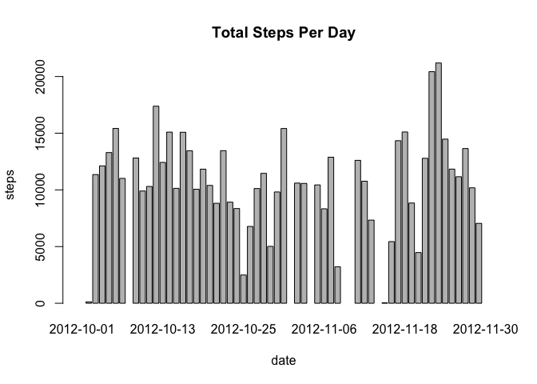
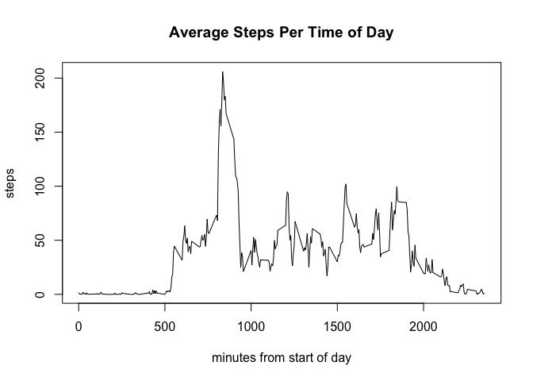
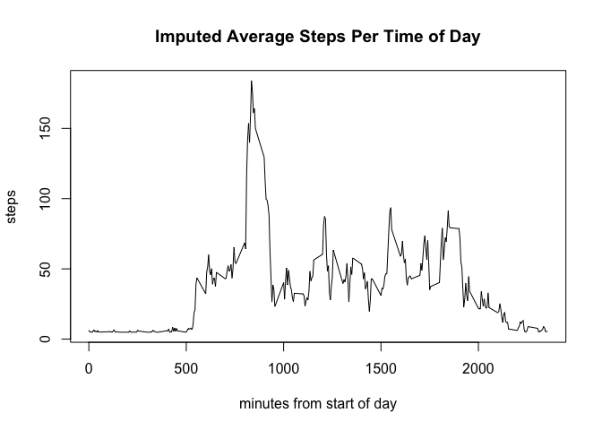
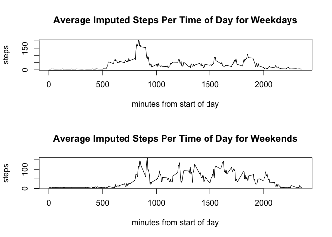

## Loading and preprocessing the data


```r
unzip("activity.zip")
raw <- read.csv("activity.csv")
clean <- raw[!is.na(raw$steps),]
clean$steps <- as.numeric(clean$steps)
```

## What is mean total number of steps taken per day?


```r
sums <- tapply(clean$steps, clean$date, sum)
barplot(sums, xlab = "date", ylab = "steps", main = "Total Steps Per Day")
```

<!-- -->

```r
meanSteps <- as.integer(mean(sums, na.rm = TRUE))
medianSteps <- as.integer(median(sums, na.rm = TRUE))
```

The mean total number of steps taken per day is 10766 and the median
steps taken per day is 10765.

## What is the average daily activity pattern?


```r
averageSteps <- tapply(clean$steps, clean$interval, mean)
minutes <- as.numeric(dimnames(averageSteps)[[1]])
plot(minutes, averageSteps, type = "l", xlab = "minutes from start of day",
	ylab = "steps", main = "Average Steps Per Time of Day")
```

<!-- -->

```r
maximumValue <- which.max(averageSteps)
maximumIndex <- names(maximumValue)
```

The largest average number of steps (104) tends to occur at the
835 5-minute interval.

## Imputing missing values


```r
require("mlr")
```

```
## Loading required package: mlr
```

```
## Loading required package: ParamHelpers
```

```r
missingValues <- is.na(raw)
totalMissingValues <- sum(is.na(raw))
imputed <- impute(raw, classes = list(integer = imputeMean()))
imputedAverageSteps <- tapply(imputed$data$steps, raw$interval, mean)
plot(minutes, imputedAverageSteps, type = "l", xlab = "minutes from start of day",
	ylab = "steps", main = "Imputed Average Steps Per Time of Day")
```

<!-- -->

```r
imputedSums <- tapply(imputed$data$steps, imputed$data$date, sum)
maximumImputedValue <- which.max(imputedAverageSteps)
maximumImputedIndex <- names(maximumImputedValue)
meanDiff <- abs(maximumImputedValue - maximumValue)
changed <- sum(is.na(sums))
```

There are 2304 missing values in the raw dataset.  I've imputed
the missing values by the mean for the dataset (integer = imputeMean()).

With this imputed dataset, the largest average number of steps
(104) tends to occur at the 835
5-minute interval.

The new imputed mean differs from the original mean by 0.  8
total daily estimates were increased through imputation, but since we used the
dataset average to impute, there is no increase in the total mean created by
imputation.

## Are there differences in activity patterns between weekdays and weekends?


```r
require("lubridate")
```

```
## Loading required package: lubridate
```

```
## 
## Attaching package: 'lubridate'
```

```
## The following object is masked from 'package:base':
## 
##     date
```

```r
impData <- imputed$data
impData$weekday <- ifelse(weekdays(ymd(impData$date)) %in% c("Saturday", "Sunday"),
	"weekend", "weekday")
splitData <- split(impData, impData$weekday)
weekends <- splitData$weekend
weekdays <- splitData$weekday
imputedWeekdayAverageSteps <- tapply(weekdays$steps, weekdays$interval, mean)
imputedWeekendAverageSteps <- tapply(weekends$steps, weekends$interval, mean)

par(mfrow = c(2, 1))
plot(minutes, imputedWeekdayAverageSteps, type = "l", xlab = "minutes from start of day",
	ylab = "steps", main = "Average Imputed Steps Per Time of Day for Weekdays")
plot(minutes, imputedWeekendAverageSteps, type = "l", xlab = "minutes from start of day",
	ylab = "steps", main = "Average Imputed Steps Per Time of Day for Weekends")
```

<!-- -->
